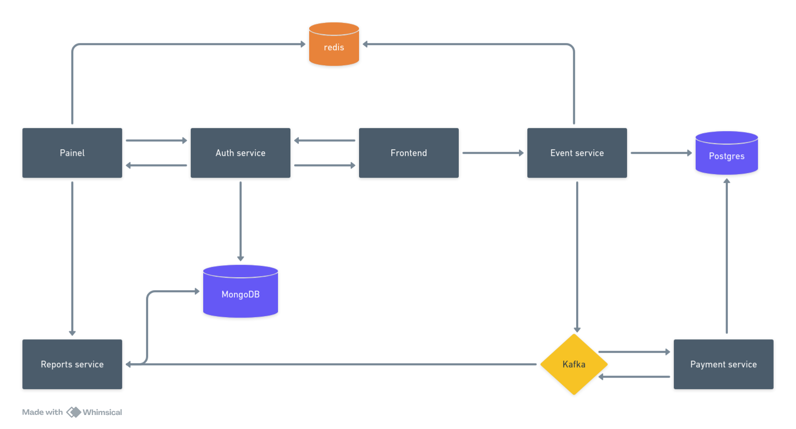

# Plano de ação para Sistema de bilheteria do Cassino

## 1. Análise das necessidades do negócio

Antes de tomar as decisões técnicas, acredito que o primeiro passo seria realizar um alinhamento com as partes interessadas do negócio. O que inclui entender bem os desafios que são enfrentados pelo cassino, os objetivos de curto e longo prazo, e os requisitos dos usuários finais. Dito isso, o foco inicial seria:

- Alinhamento com o negócio: idenficiação das prioridades e expectativas do novo sistemas;
- Mapeamento dos requisitos: principalmente as dores no processo de compra;
- Analisar diferentes cenários;

## 2. Arquitetura proposta

### 2.1 Microsserviços

Uma arquitetura de microsserviços nos permite escalar diferentes partes de um sistema de forma independente.

- Serviços principais: Autenticação (authentication/auth), Ingressos (tickets), Pagamentos (payments), Relatórios (reports).

### 2.2 Cache distribuído

Uma implementação de cache distribuído nos ajuda a armazenas dados frequentemente acessados (disponibilidade de ingressos e preços) e também melhora o desempenho da aplicação durate picos de acessos.

### 2.3 Banco de Dados

Para atender as necessidades de consistência e de escalabilidade será adotado uma abordagem híbrida, utilizando um banco de dados SQL e um NoSQL.

### 2.4 Mensageria

Para poder gerenciar a alta demanda e garantir melhor a consistencia dos dados será adotado um sistema de mensageria, no qual será utilizado para processar as transações de vendas de ingressos de forma assíncrona, e fazer a comunicação com base em eventos em outros pontos da aplicação.

### 2.5 Sockets

O uso de sockets possibilita que o painel de administração seja em tempo real, e permite os administradores possam monitorar vendas e ajustar os preços.

## 3. Decisões tecnológicas

### 3.1 Backend

Será utilizado o ecossistema Nodejs, mas especificamente seu framework Nestjs, por ser um framework bem robusto, modularizado, validado no mercado e possui uma grande gama de funcionalidades que nos ajuda a implementar as necessidades do negócio. 

Para o sistema de cache distribuído será utilizado o Redis, por sua facilidade de uso e velocidade nas consultas e escritas.

Para banco de dados, será utilizado tanto um banco SQL (Postgres) quanto um NoSQL (MongoDB). O uso do Postgres é para o processamento de pagamentos e conclusão de compra dos ingressos, pois ele possui uma maior gama de particularidades para garantir a integridade financeira e operacional. Já o uso do Mongo é para o espelhamento dos dados, possibilitando que os relatório para o painel sejam gerados de forma mais rápida e eficiente.

Para o sistema de mensageria será utilizado o Kafka, pois ele persiste as mensagens que trafegam por ele, até que sejam consumidas pelo serviço que as utilizam.

### 3.2 Frontend

O framework Nextjs será escolhido pela sua capacidade de SSR, na qual garante mais segurança à páginas mais sensíveis.

## 4. Estratégias de Resiliência

Focando na escalabilidade automática, o sistema rodará em cima de um Kubernetes, garantindo que o sistema possa crescer conforme o necessário para atender as demandas, sem compromenter o desempenho e escalabilidade.

Além disso, a estratégia de Mensageria com Kafka também pode ser levada em consideração, já que as mensagens são persistidas até o momento de serem completamente processadas.

## 5. Plano de Contingência

O código será construídos em cima de mecanismos e padrões de rollback, como o Unit Of Word, para garantir que transações parcialmente completadas possam ser revertidas em caso de falhas.

Além disso, o sistema de mensageria pode garantir a comunicação assertiva de eventos entre os microsserviços para que a informação seja repassado entre todos.

## 6. Representação Gráfica da arquitetura proposta

